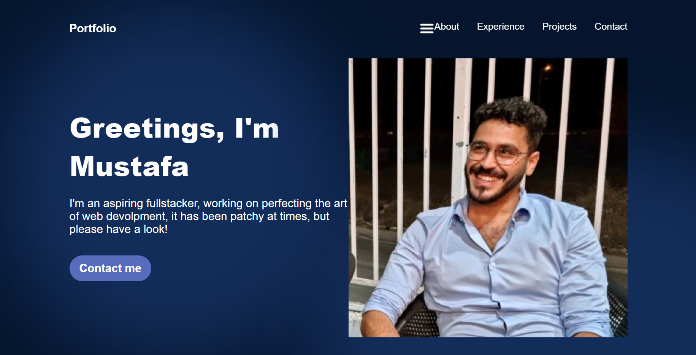
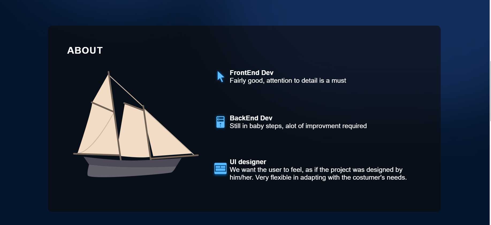
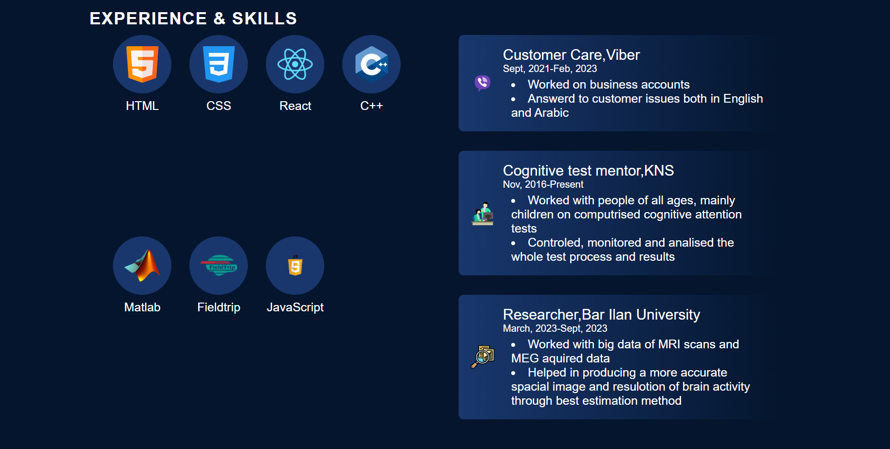
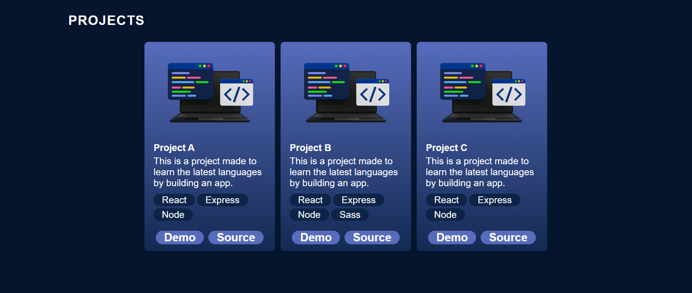
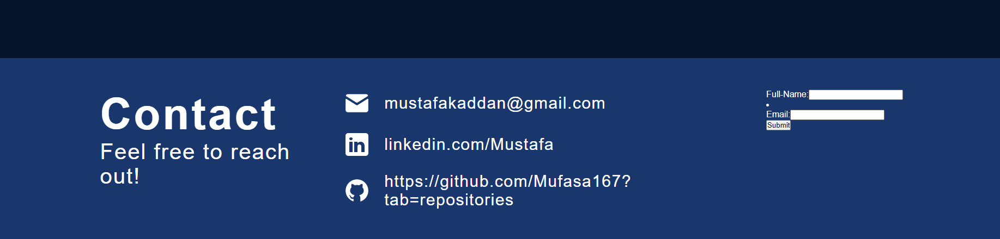

# React Portfolio

in this projectI tried to create a demo template of my personal portfolio containing:

1.Hero
2.About
3.Experience and skills
4.Cards of projects
5.Contact us and a simple form

The project was written in react, js,css and 3 json files for the data acquisition.

The project template was inspired from a portfolio on figma:https://www.figma.com/file/tkDs3aeBaqvF47hD063LSH/Untitled?type=design&node-id=0-1&mode=design&t=et4C7SKSnmIbAh5w-0

Screenshots:

 

 

 

 

